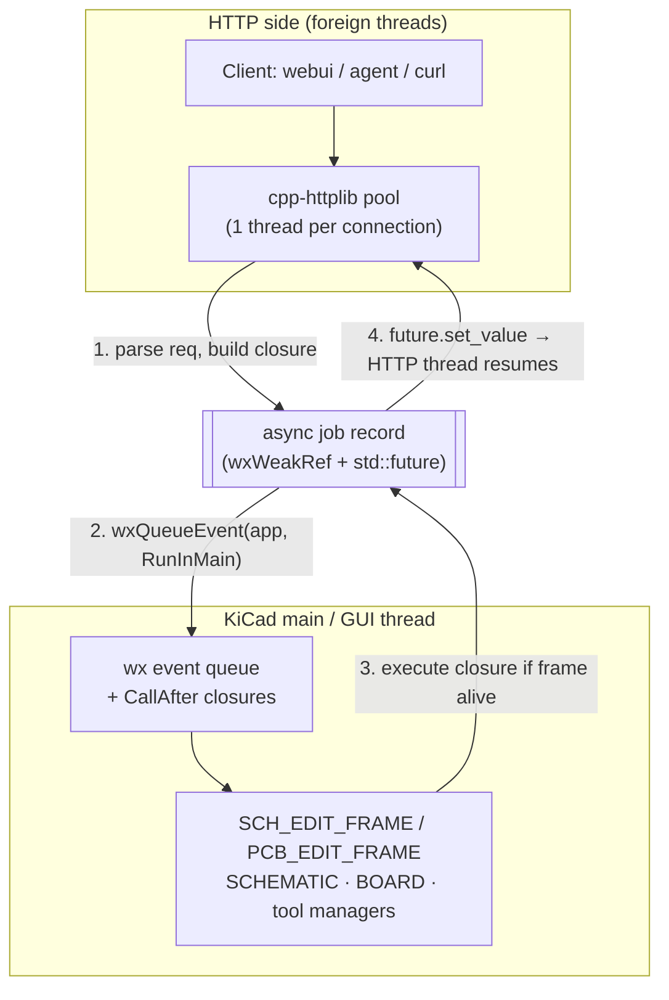
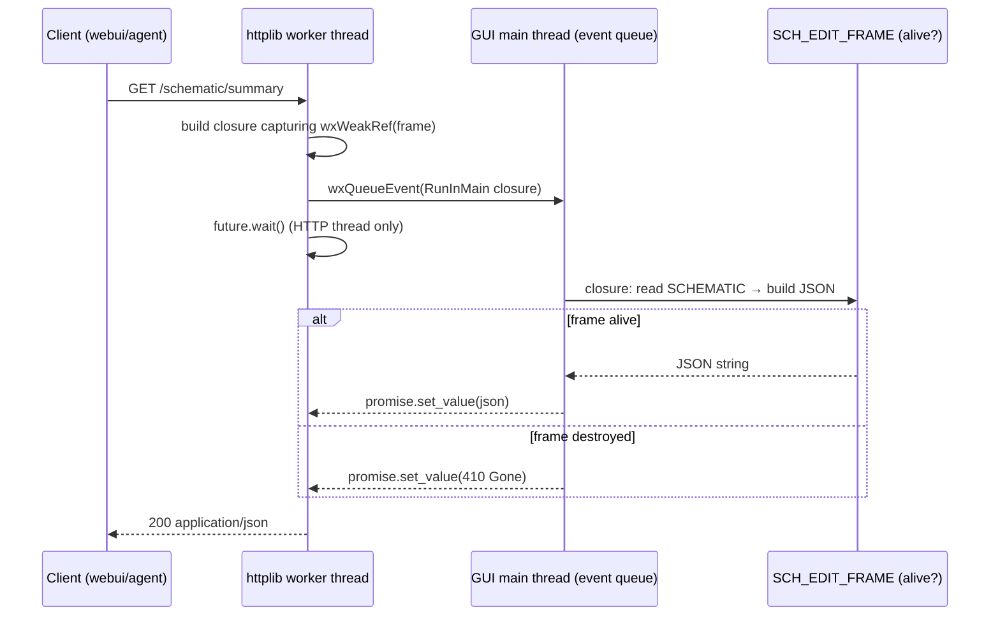

# kicadweb — Architecture: Threading, Decoupling, and Race-Condition Safety

Date: 2026-10-07 · Branch: `realtime-refresh` · Component: `kicadweb/` (in-tree, per-utility)
Decision: **DEC-003** — in-process HTTP service embedded into each KiCad utility
(eeschema, pcbnew, PGM), with full direct access to the CAD object model.
Supersedes out-of-process approaches for live control (see `GAP-ANALYSIS.md`, `ROADMAP.md`).

---

## 1. Constraints that drive the design

| Constraint | Consequence |
|---|---|
| KiCad is a wxWidgets GUI app: **one main/GUI thread** owns all UI objects, `SCHEMATIC`, `BOARD`, tool managers | No HTTP worker thread may ever touch the object model directly |
| cpp-httplib spawns **one thread per connection** | Handlers run on foreign threads by default — treat them as pure I/O only |
| Interactive tools own transactions on the main thread | Mutations must go through commits (`SCH_COMMIT`/`BOARD_COMMIT`), never raw model edits |
| Frames are destroyed while HTTP threads may be mid-request | Need weak references + shutdown ordering, or callbacks touch freed memory |
| Main thread must **never** wait on an HTTP thread | Prevents trivial deadlocks (modal loops, slow clients) |

**Core rule: HTTP threads marshal; the GUI thread executes.**

## 2. Thread architecture



**Marshal primitive** (`kicadweb/marshal.h`):

```cpp
// Runs fn on the GUI main thread and returns its result to the calling
// (HTTP) thread. Never blocks the GUI thread on the caller.
std::future<std::string> RunInMain( std::function<std::string()> fn );

// implementation sketch
//   auto pr = std::make_shared<std::promise<std::string>>();
//   auto fut = pr->get_future();
//   wxWeakRef<wxEvtHandler> sink = wxTheApp;            // app outlives frames
//   wxQueueEvent( sink, new ExecuteInMainEvent( [fn = std::move(fn), pr]()
//                   { pr->set_value( fn() ); } ) );
//   return fut;
```

- `ExecuteInMainEvent` is a custom wx event carrying `std::function<void()>`; handled by
  an app-level handler registered once at service startup.
- The closure captures a **`wxWeakRef<KICAD_WEB_SERVICE_HOST>`** (the frame). If the frame
  died before execution, the closure returns a `410 Gone` JSON instead of touching memory.
- `std::future` bridges the result back to the HTTP worker; the GUI thread only *sets* the
  value and continues its event loop — **no GUI-side blocking anywhere**.

## 3. Request lifecycle (read example)



Mutation requests are identical, except the closure performs the change **through a
commit** (`SCH_COMMIT`/`BOARD_COMMIT` → `Push()`), which keeps undo working and — with the
`realtime-refresh` patch — repaints the canvas immediately.

## 4. Race-condition matrix

| # | Hazard | Where | Mitigation |
|---|---|---|---|
| R1 | HTTP thread reads `SCHEMATIC`/`BOARD` while GUI mutates | handler thread | **No model access off-thread** — all reads are closures on the main thread (§2) |
| R2 | Frame destroyed while handler in flight | frame dtor vs worker thread | closure holds `wxWeakRef`; service `stop()` runs **first** in frame dtor; app-sink drops closures for dead frames (`410`) |
| R3 | Two HTTP requests mutate concurrently | httplib pool | All closures execute on the single GUI thread → **serialized by construction**; no locks needed around the model |
| R4 | Deadlock: GUI waits on HTTP worker | future misuse | Rule: GUI closures **never** call the HTTP layer; they only `set_value` and return |
| R5 | Modal dialog blocks main loop, closure delayed | wx modal loop | Modal loops still dispatch queued events → closure runs late but safe; long ops are rejected (`503 busy`) rather than queued unbounded |
| R6 | Port collisions between utilities (eeschema + pcbnew + PGM) | startup | Fixed per-utility ports + discovery file `/tmp/kicad/web-{pid}.json` (mirrors `api-{PID}.sock` pattern) |
| R7 | Audit/replay ordering | bridge | Sequence numbers assigned on the GUI thread inside the closure — total order = commit order |
| R8 | Heavy request starves UI (e.g. big export in-loop) | main thread | Endpoints declare `fast`/`deferred`; `deferred` ones post a job and return `202` with a job id (poll `/jobs/{id}`) |

## 5. Lifecycle and shutdown ordering

```mermaid
flowchart LR
    subgraph Frame creation
        A[SCH_EDIT_FRAME ctor] --> B[new KICAD_WEB_SERVICE<br/>register endpoints]
        B --> C[start(): spawn worker thread<br/>write /tmp/kicad/web-{pid}.json]
    end
    subgraph Frame destruction
        D[~SCH_EDIT_FRAME] --> E[1. service.stop()<br/>httplib stop, join worker]
        E --> F[2. drain pending closures<br/>weak-ref → 410 Gone]
        F --> G[3. remove discovery file]
        G --> H[4. destroy model & frame]
    end
```

- `stop()` **joins** the httplib workers before the model dies → no use-after-free.
- Closures already queued behind the join are resolved as `410` (weak-ref check).
- App-level sink is registered once per process (first service) and never unregistered.

## 6. Multi-utility ports and discovery

| Utility | Default port | Discovery |
|---|---|---|
| PGM (project manager) | 4241 | `/tmp/kicad/web-{pid}.json` |
| eeschema | 4242 | „ |
| pcbnew | 4243 | „ |

Override: `KICADWEB_PORT_<UTILITY>` env or `--kicadweb-port`. The JSON discovery file
contains `{ "utility", "pid", "port", "socket" }` — the bridge reads these like it reads
`api-{PID}.sock`.

## 7. OpenAPI + webui (single source of truth)

Endpoints are declared once in a table:

```cpp
AddEndpoint( "GET",  "/schematic/summary",
             "Counts symbols, sheets, and labels of the open schematic",
             [weak = m_weakThis]{ return RunInMain( ... ).get(); } );
```

- `GET /openapi.json` is generated by walking the table (method, path, summary;
  request/response schemas added incrementally per endpoint).
- `GET /` serves the embedded static webui (single HTML file, embedded via
  `wxEmbeddedImage`-style resource or C string) — a test client: endpoint list, form
  fields from the spec, pretty JSON output. No build tooling, no node.
- Adding an endpoint = one `AddEndpoint` call + optional schema entry. Spec, webui, and
  routing never drift.

## 8. File layout and integration points

| File | Content |
|---|---|
| `kicadweb/kicad_web_service.h/.cpp` | transport + endpoint table + OpenAPI (done, needs §2 marshal added) |
| `kicadweb/marshal.h` | `RunInMain`, `ExecuteInMainEvent`, app sink (new) |
| `kicadweb/webui.html` | embedded test client (new, static) |
| `eeschema/sch_edit_frame.{h,cpp}` | member `std::unique_ptr<KICAD_WEB_SERVICE>`, start in ctor, stop-first in dtor, `schematic` endpoints |
| `eeschema/CMakeLists.txt` | add `kicadweb/` sources, include dir, httplib header path |
| `pcbnew/…`, `kicad/…` | same pattern, later increments |

## 9. Implementation checklist

- [x] Transport skeleton (`kicad_web_service.{h,cpp}`)
- [ ] `marshal.h` (`RunInMain` + app sink + weak-ref resolution)
- [ ] Frame integration in eeschema (ctor/dtor ordering per §5)
- [ ] `/schematic/summary`, `/schematic/refresh` endpoints (commit-based)
- [ ] Discovery file + port table
- [ ] Embedded webui client
- [ ] Conformance: hammer test (parallel curl) + frame-close-during-request test
- [ ] pcbnew + PGM instantiation

## 10. What this removes

| Previously | Now |
|---|---|
| kipy / protobuf / python venv chains | REST + JSON, no runtime deps |
| uv / grpcio-tools / gencode mismatches | C++ protos not needed at all (direct model access) |
| stdio session management in bridge | bridge = thin search/invoke over REST (or later: C++ MCP shim) |
| `pushCurrentCommit` canvas-refresh patch for live edits | refresh endpoint + same-thread commits |
